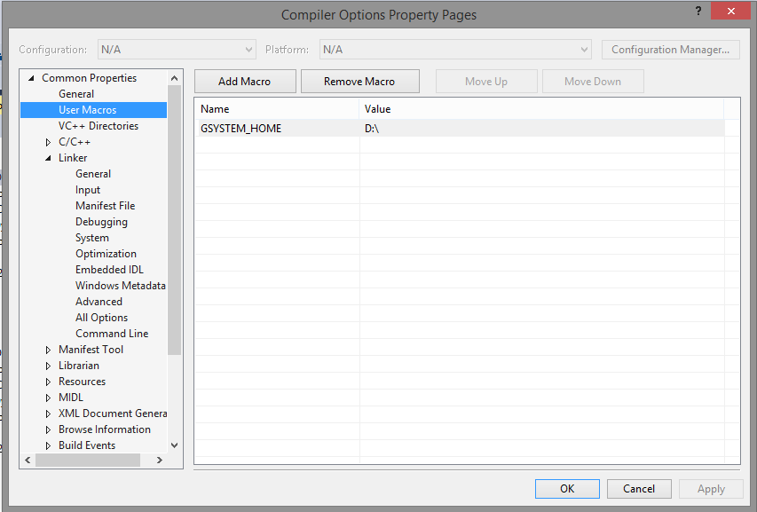

# Common

## Header and cpp files that are common across many of the repositories here 
---

The projects here are <strong>interrelated</strong>.
   
I have created a "Environment Variable" to allow you put these repositories in any arbitrary location <strong>EXCEPT</strong> they still MUST be siblings.

This environment variable is GSYSTEM_HOME.

Note, you can accomplish the definition in 1 of two ways.

Obviously, create the environment variable in Control Panel - System Settings - Advanced, as you would other environment variables.

OR - in Visual Studio, go to the Property Manager tab usually a sibling to the Solution Explorer tab, double click on "Compiler Options" under any configuration of any project - these are the "global" configuration settings for all projects (indeed, for all projects from every repository).

Please note that if you create an environment variable in the old way - then you SHOULD clear the value as shown above - or at least make sure it is the same value.

